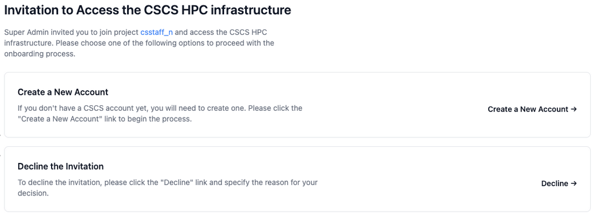
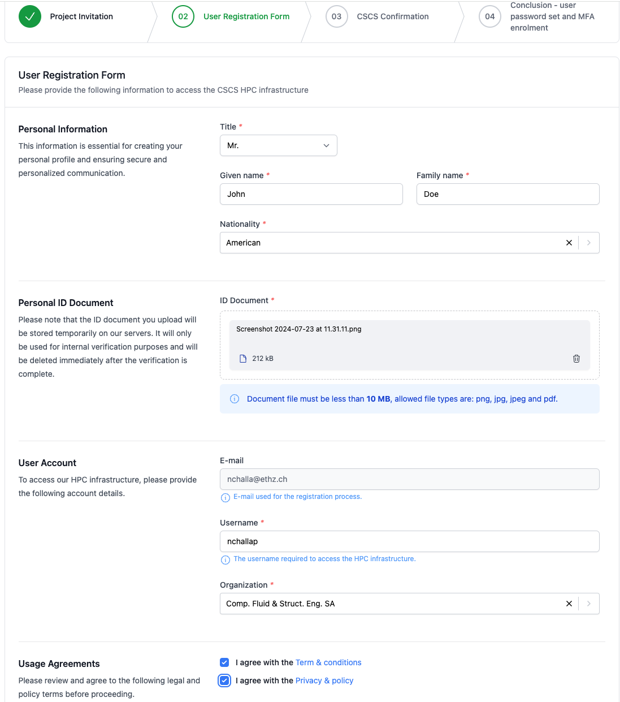
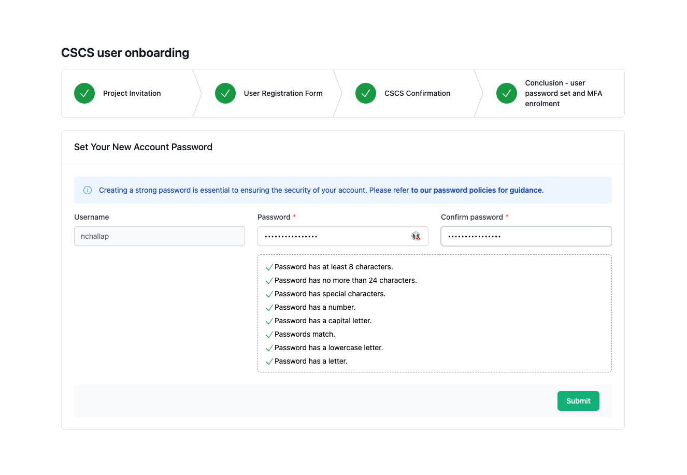
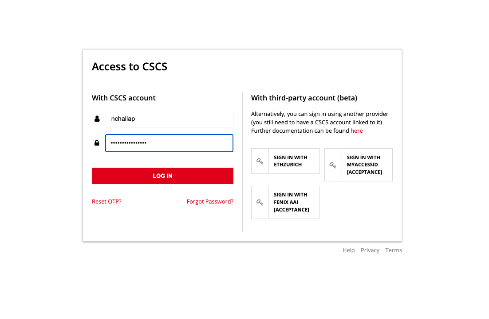
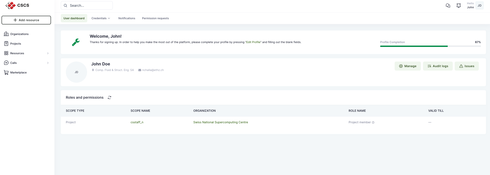

[](){#ref-account-create}
# Creating an account

!!! warning
    The process for creating an account documented here applies only to users who are invited using the new [project and resource management tool][ref-account-waldur] (Waldur).

When the CSCS Account Manager, project PI or Deputy PI invites the users they will receive an invitation email if the invited user has an **existing** CSCS account then the user clicks on the URL from the email and log-in with a username, password, OTP, and accept the invitation **whereas** if the invited user is new then the user needs to follow the step-by-step instructions below to get an account

The email contains a URL that redirects you to the registration page:



Clicking the "Create a new account" button will lead the user to the second step where he needs to provide his personal information as shown below:



After submitting personal information, users have to wait for CSCS to review and approve the submission.

Once accepted, you will recieve an email with a link to set your password.

```title="Acceptance email"
Dear John Doe,

Your username is nchallap.

Please click here to set your password.

Yours sincerely,

CSCS Support Team.
```

Following the link in this email will take you to a page where you set your password.



After your password has been set, you will be redirected to a page where you log in using your username and password



From here you will need to set up [multi-factor authentification][ref-mfa-configure-otp] (MFA).

Once MFA has been configured, you will finally be redirected to the CSCS portal as shown:


