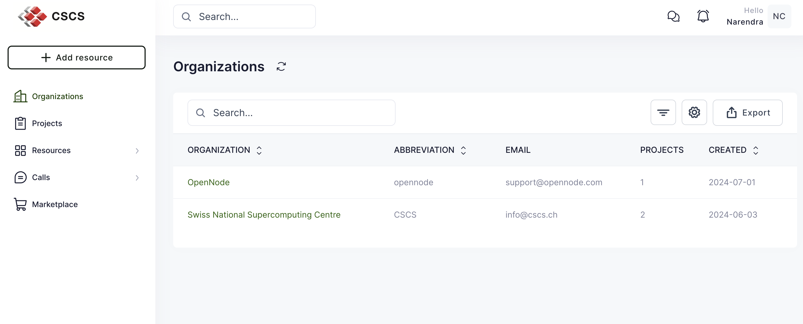
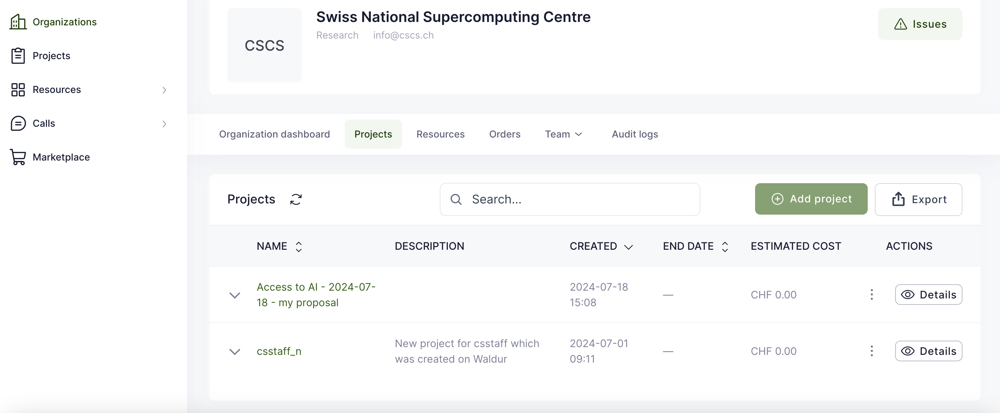
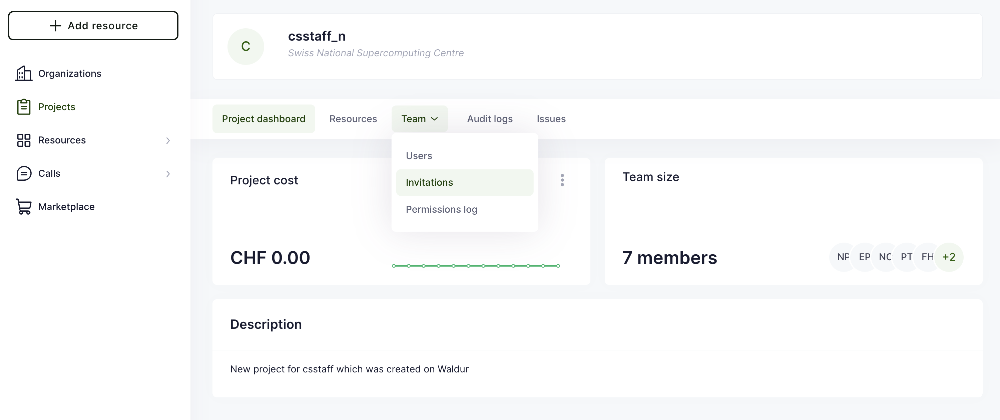
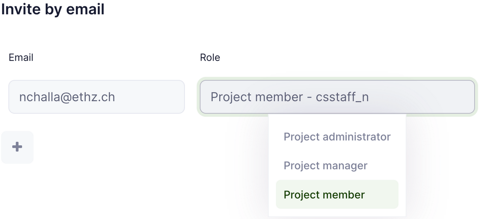

[](){#ref-account-waldur}
# The Project and Resources Management Tool

CSCS Account Managers, PIs and deputy PIs can invite users to the respective projects following the below steps on CSCS's new project management portal.

!!! info
    The new user project management portal is currently only used by the [Machine Learning Platform][ref-platform-mlp]
    All other platforms use the old [user management portal][ref-account-ump]

## log in to the portal

Navigate to the site project management portal [portal.cscs.ch](https://portal.cscs.ch/).

## Select the Organisation

After login to the portal, choose the corresponding organization in which the project was created.



In this example, the project was hosted by the CSCS organization and the project name is `csstaff_n`. From the organization dashboard navigate to Projects and click on the `csstaff_n` project



## Invite users

From the project dashboard, navigate to Team -> Invitations



!!! info
    Using both the web interface and bulk invitation, the following roles can be assigned in the tool:

    * _Project administrator_: PI
    * _Project manager_:  deputy PI
    * _Project member_: team member

=== "invite individual users"

    To invite an individual user, click on the green "Invite Users" button on the right hand side of the tab.

    You will then be prompted to enter the invitee's email address and assign them a role (PI, deputy PI or member)

    

    !!! note "Role definitions"
        The Waldur tool uses the following labels for the roles:

        * **Project administrator**: PI
        * **Project manager**: deputy PI
        * **Project member**: member

=== "bulk invite"

    It is also possible to bulk invite users by preparing a CSV file and uploading it in this step.

    ```csv
    Email,Role,Project
    CragAlvarado@example.com,Project member,prj02
    Andrease@example.com,Project member,prj02
    JoannWaters@example.com,Project administrator,prj02
    DonnaSchwartz@example.com,Project manager,prj02
    ```

!!! note
    An email will be sent to invited users:

    * users who already have CSCS accounts should click on the link in the email they received, and authenticate against CSCS KeyCloak with username, password, and OTP to accept the invitation.
    * new users should follow the procedure to [create a CSCS account][ref-account-create].
