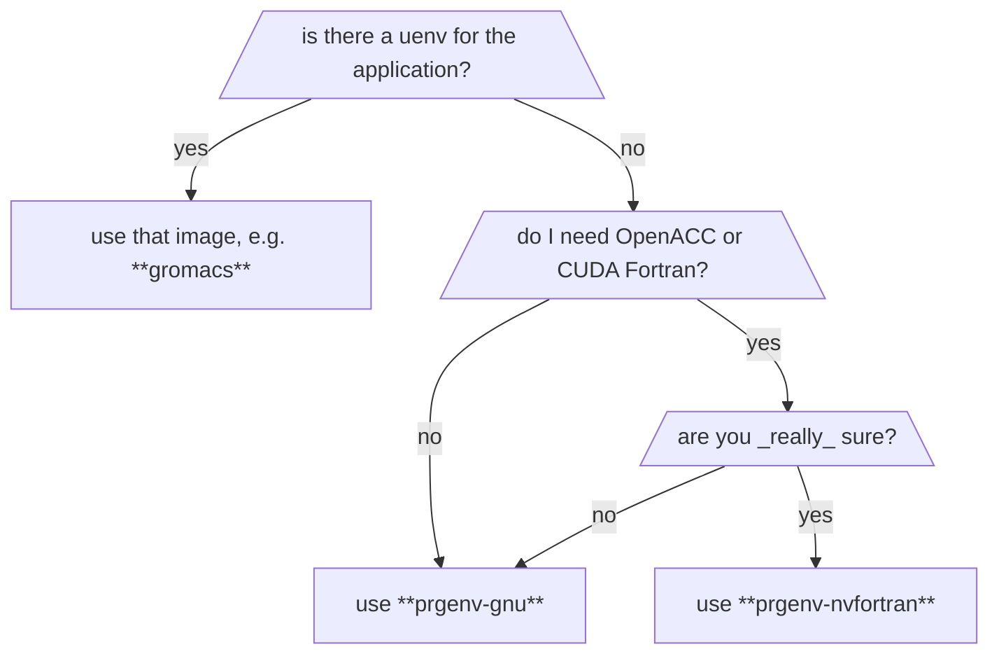

Uenv are user environments that provide scientific applications, libraries and tools on [Alps][ref-alps]. 
This article explains how to use them to build software.

For more documentation on how to find, download and use uenv in your workflow,
see the [uenv documentation][ref-uenv].

[](){#ref-building-uenv-spack}
## Building software using Spack

Each uenv is tightly coupled with [Spack] and can be used as an upstream [Spack] instance, because
the software in uenv is built with [Spack] using the [Stackinator] tool.

CSCS provides `uenv-spack` - a tool that can be used to quickly install software using the software and configuration provided inside a uenv, similarly to how `module load` loads software packages.

### Installing `uenv-spack`

```bash
git clone https://github.com/eth-cscs/uenv-spack.git # (1)!

(cd uenv-spack && ./bootstrap) # (2)!

export PATH=$PWD/uenv-spack:$PATH
```

1. Download the `uenv-spack` tool from GitHub.

2. Initialize the `uenv-spack` tool.

### Select the uenv

The next step is to choose which uenv to use.
The uenv will provide the compilers, Cray MPICH, and other libraries and tools.



!!! tip "Use `prgenv-gnu` when in doubt"
    If you don't know where to start, use the latest release of the `prgenv-gnu` on the system that you are targeting.
    It provides the latest versions of `gcc`, `cray-mpich`, `python` and commonly used libraries like `fftw` and `boost`.

    On systems that have NVIDIA GPUs (`gh200` and `a100` uarch), it also provides the latest version of `cuda` and `nccl`, and it is configured for GPU-aware MPI communication.

To use an uenv as an [upstream Spack instance](https://spack.readthedocs.io/en/latest/chain.html),
the uenv has to be started with the `spack` view:

```bash
uenv start prgenv-gnu/24.11:v1 --view=spack
```

!!! note "What does the `spack` view do?"
    The `spack` view sets environment variables that provide information about the version of Spack that was used to build the uenv, and where the uenv Spack configuration is stored.
    
    | <div style="width:12em">variable</div> | <div style="width:18em">example</div> | description |
    | -------- | ------- | ----------- |
    | `UENV_SPACK_CONFIG_PATH` | `user-environment/config` | the path of the upstream [spack configuration files]. |
    | `UENV_SPACK_REF`         | `releases/v0.23` | the branch or tag used - this might be empty if a specific commit of Spack was used. |
    | `UENV_SPACK_URL`         | `https://github.com/spack/spack.git` | The git repository for Spack - nearly always the main spack/spack repository. |
    | `UENV_SPACK_COMMIT`      | `c6d4037758140fe...0cd1547f388ae51` | The commit of Spack that was used |

    !!! warning

        The environment variables set by the `spack` view are scoped by `UENV_`.
        Therefore, they don't change Spack-related environment variables.
        You can use them to consistently set Spack-related environment variables.

??? warning "Upstream Spack version"

    It is strongly recommended that your version of Spack and the version of Spack in the uenv match when building software on top of an uenv.

!!! note "Advanced Spack users"

    Advanced Spack users can use the environment variables set by the `spack` view to manually configure the uenv as a Spack upstream instance.
    
    !!! tip
        If using multiple uenvs, we recommend using a different Spack instance per uenv.

    ??? example "Setting Spack configuration path"
    
        ```bash
        export SPACK_SYSTEM_CONFIG_PATH=$UENV_SPACK_CONFIG_PATH
        ```

### Describing what to build

The next step is to describe what software to build.
This is done using a [Spack environment file] and a [Spack package repository].

The `uenv-spack` tool can be used to create a build directory with a template [Spack environment file] (`spack.yaml`) and a [Spack package repository] (`repo/` directory).

!!! example "Create a build directory with a Spack environment file and a Spack package repository"

    ```bash
    uenv-spack <build-path> --uarch=gh200
    cd <build-path>
    ./build
    ```

    `<build-path>` is a path (typically in `$SCRATCH`, e.g. `$SCRATCH/builds/gromacs-24.11`).


`uenv-spack` creates a directory tree with the following contents:

```bash
<build-path>
├─ build # (1)!
├─ spack # (2)!
├─ config # (3)!
│   ├─ meta.json # (4)!
│   ├─ user
│   │  ├─ config.yaml
│   │  ├─ modules.yaml
│   │  └─ repos.yaml
│   └─ system
│      ├─ compilers.yaml
│      ├─ packages.yaml
│      ├─ repos.yaml
│      └─ upstreams.yaml
└─ env # (5)!
    ├─ spack.yaml # (6)!
    └─ repo # (7)!
       ├─ repo.yaml
       └─ packages
```

1. Script to build the software stack.
2. `git` clone of the required version of Spack.
3. Spack configuration files for the software stack.
4. Information about the uenv that was used to run `uenv-spack`.
5. Description of the software to build.
6. Template [Spack environment file].
7. Empty [Spack package repository].

The `env` path contains a template `spack.yaml` file, and an empty [Spack package repository]:

```
env
├─ spack.yaml
└─ repo
   ├─ repo.yaml
   └─ packages
```

where the `spack.yaml` file contains an empty list of specs:

```yaml
    specs: []
```

Edit this file to add the specs that you wish to build, for example:

```yaml
    specs: [tree, screen, emacs +treesitter]
```

The step of adding a list of specs to the `spack.yaml` template can be skipped by providing them using the `--specs` argument to `uenv-spack`.

!!! example "Create a build path and populate the `spack.yaml` file with some Spack [specs]"

    ```bash
    uenv-spack $SCRATCH/install/tools --uarch=gh200 \
               --specs="tree, screen, emacs +treesitter"
    cd $SCRATCH/install/tools
    ./build
    ```

If you already have a directory with a complete `spack.yaml` file and custom repo,
you can provide it as an argument to `uenv-spack`:

!!! example "Create a build path and use a pre-configured `spack.yaml` and `repo`"

    ```bash
    uenv-spack $SCRATCH/install/arbor --uarch=gh200 \
               --recipe=<path-to-recipe>
    cd $SCRATCH/install/tools
    ./build
    ```

??? example "Create a build path and use your own `spack.yaml`"

    !!! warning "NOT YET IMPLEMENTED"

        ```bash
        uenv-spack $SCRATCH/install/arbor --uarch=gh200 \
                   --recipe=<path-to-spack.yaml>
        cd $SCRATCH/install/tools
        ./build
        ```

### Build the software

Once specs have been added to `spack.yaml`, you can build the image using the `build` script that was generated in `<build-dir>`:

```bash
./build
```

This process will take a while, because the version of Spack that was downloaded needs to

* bootstrap,
* concretise the environment,
* and build all of the packages.

The duration of the build depends on the specs: some specs may require a long time to build, or require installing many dependencies.

The build step generates multiple outputs, described below.

### Installed packages

The packages built by Spack are installed in `<build-dir>/store`.

### Spack view

A Spack view is generated in `<build-dir>/view`.

### Modules

Module files are generated in the `module` sub-directory of the `<build-path>`

To use them, add them to the module environment

```bash
module use <build-dir>/modules # (1)!
module avail # (2)!
```

1. Make modules available.
2. Check that the modules are available.

!!! note
    The generation of modules can be customised by editing the `<build-dir>/config/user/modules.yaml` file _before_ running `build`.
    See the [Spack modules] documentation.

### Use the software

!!! warning

    This step is not fully covered by the tool/workflow yet.

!!! warning

    The uenv that was used to configure and build must always be loaded when using the software stack.

To use the installed software, you have the following options:

* Loading modules
* Activate the Spack view
* `source <build-dir>/spack/share/spack/setup-env.sh` and then use Spack

[Chaining Spack Installations]: https://spack.readthedocs.io/en/latest/chain.html
[Spack]: https://spack.readthedocs.io/en/latest/
[Spack Basic Usage]: https://spack.readthedocs.io/en/latest/basic_usage.html
[Spack modules]: https://spack.readthedocs.io/en/latest/module_file_support.html
[Spack package repository]: https://spack.readthedocs.io/en/latest/repositories.html
[Stackinator]: https://eth-cscs.github.io/stackinator/
[Spack configuration files]: https://spack.readthedocs.io/en/latest/configuration.html
[spec]: https://spack.readthedocs.io/en/latest/basic_usage.html#sec-specs
[specs]: https://spack.readthedocs.io/en/latest/basic_usage.html#sec-specs
[Spack environment file]: https://spack.readthedocs.io/en/latest/environments.html
